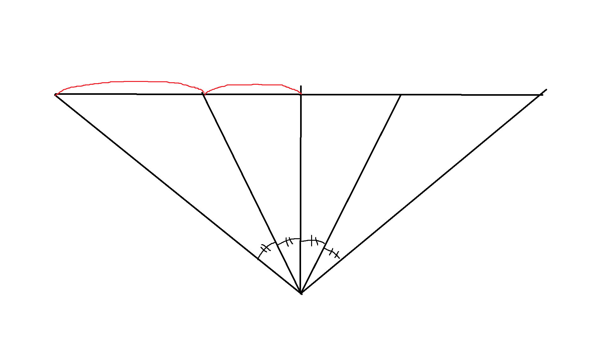

import { NoSSR } from '../../../_internal/NoSSR';
import { Collapse } from '../../common/components/Collapse';

import { Preview0 } from './components/Preview0';
import { Preview1 } from './components/Preview1';
import { Preview2 } from './components/Preview2';

!> 이 글은 [raytracer](/tags/raytracer) 시리즈입니다.

## 목차 \{#TOC\}

[TOC]

## 유틸 \{#utils\}

```c file=../../embed/util.h title="util.h"
```

우선 공통으로 쓰일 부분들을 따로 함수로 빼 두자.

```c file=../../embed/util.c title="util.c"
```

## 원근 카메라 \{#perspective-camera\}

[이전 글](/posts/2024-06-16-the-raytracer-project-start)에서 간이로 간단한 직교 카메라를 구현했었다.

카메라를 바꾸고 비교하기 위해 먼저 씬을 좀 바꿔보자.

```diff-c file=./embed/0.diff
```


<NoSSR><Collapse title="직접 시도해 보기"><Preview0 /></Collapse></NoSSR>

이제 카메라를 아주 간단히 바꿔보자.

```diff-c file=./embed/1.diff
```

여기에서 fov란 **F**ield **O**f **V**iew, 시야각을 의미한다.


<NoSSR><Collapse title="직접 시도해 보기"><Preview1 /></Collapse></NoSSR>

일단 여기에는 문제가 좀 있다. 딱 봐도 이상해 보인다.



각도를 기준으로 하면 평면에 투영했을 때 거리가 달라진다.

```diff-c file=./embed/2.diff
```

그렇다면 거리를 기준으로 하면 어떨까?


<NoSSR><Collapse title="직접 시도해 보기"><Preview2 /></Collapse></NoSSR>

각도가 달라진다. 어떻게 하든 왜곡은 생기지만, 이는 어쩔 수 없는 현상이다.


어쨌든 본격적으로 카메라를 구현해보자.

```c file=../../embed/ray.h title="ray.h"
```

일단 `ray.h`를 공통으로 쓰도록 빼 두고,

```c file=../../embed/camera.h title="camera.h"
```

카메라의 타입과 카메라를 만드는 함수를 선언한다.

위에서는 가로/세로 비율이 같아서 fov 하나로 가로/세로에 같은 fov를 사용했지만, 가로/세로 비율이 다르면 각자 다른 fov를 사용해야 한다.

가로/세로 비율(이하 종횡비)이 주어지면 가로나 세로 fov 중 한 쪽에 따라 나머지 한 쪽이 정해진다.

즉, 가로 fov나 세로 fov 중 하나만 받아도 된다는 의미이다.

여기서 `camera_fov_mode_t`가 주어진 fov가 가로인지 세로인지 결정하는 데 쓰인다.

```c file=../../embed/perspective_camera.c title="perspective_camera.c"
```

이렇게 카메라를 간단히 구현 후, 이 카메라를 적용해서 테스트 해 보자.

```diff-c file=./embed/3.diff
```


이미지 가로/세로 비율을 바꿔도 대충 잘 되는 것 같다.

```diff-c file=./embed/4.diff
```


카메라 회전을 넣어도 마찬가지.

## 직교 카메라 \{#orthogonal-camera\}

```c file=../../embed/orthogonal_camera.c title="orthogonal_camera.c"
```

직교 카메라는 origin이 픽셀의 화면상의 위치에 따라 적절히 떨어져 있으면 된다.

```diff-c file=./embed/5.diff
```


